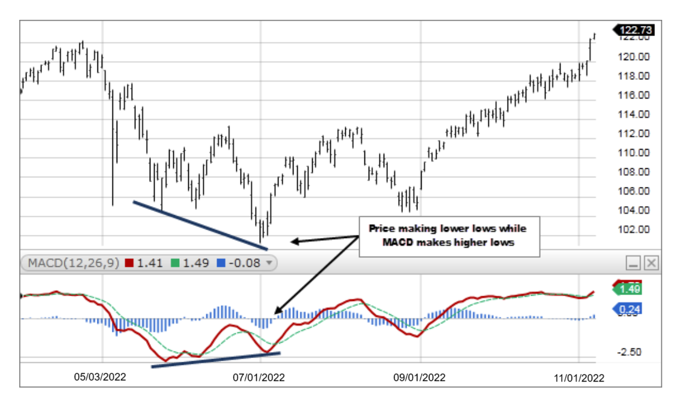

# **Trading**

## **Types of Traders**
Day trader" Buys and sells securities within the same day, closing all positions before the market closes to profit from intraday price movements.

Swing trader: Hold positions for a few days to weeks, aiming to profit from short- to medium-term price swings

Position trader: Holds positions for months or years, focusing on long-term trends and fundamentals.

Scalper: Makes rapid trades within minutes or seconds, profiting from tiny price changes.

Volatility trader: Profits from expected changes in price movement, regardless of direction, often using options or volatility indices.

Income trader: Focuses on generating regular income from dividends or selling options, rather than capital gains.

## **Indicators**
MACD(12,26,9) (Moving Average Convergence Divergence): An oscillator that shows the relationship between two moving averages of the price.

MACD Line: Trend Momentum. Bearish if < 0. Calculated by subtracting the 26-period EMA from the 12-period EMA.
Signal Line: 9-period smoothed MACD for comparison
Histogram: Negative means MACD is below signal so bearish. Represents the difference between MACD line and the signal line, providing insights into momentum.

Crossovers:   
Bullish signal when the MACD line crosses above signal line, suggesting a potential uptrend may be developing.  
Bearish signal when MACD line crosses below the signal line, indicating potential downturn.

Divergence:  
When the prices moves in one direction, while the MACD moves in the opposite direction.  
Bullish divergence: price making lower lows while MACD makes higher lows, can signal a potential price reversal to the upside, especially when combined with a crossover.

